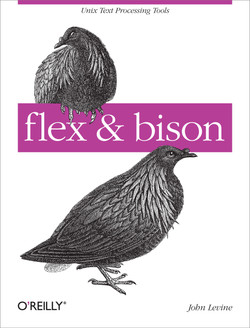

### Flex Bison

This is the code for the O'Reilly book [*flex & bison*](https://www.oreilly.com/library/view/flex-bison/9780596805418/) by John Levine.

Original code at ftp://ftp.iecc.com/pub/file/flexbison.zip.

[Flex](https://github.com/westes/flex) and [Bison](https://www.gnu.org/software/bison/) website.

- Three sections separated by '%%':
  - Definitions Section
  - Rules Section
  - User Code Section
- yyin
- yyout
- yylex()
- yyparse()
- yytext
- yyleng → lenght of current token
- yywrap() [called when reached EOF, returns non-zero to indicate that no further files need process processing; obsolete] → use: %option noyywrap
- void yyrestart(FILE *new_file) → may be called to point yyin at a new input file
- YY_BUFFER_STATE yy_create_buffer (FILE *file, int size) → used for multiple input files
- yylval
- yyerror()
- yylineno: flex provides this global variable for tracking line numbers. You are responsible for its management.
- %option nodefault → no default rule for unmatched input (recommended!)
- %s or %x (start conditions; inclusive/exclusive): inclusive → rules with no start conditions at all will also be active
  - In effect, the state defines a different scanner, with its own rules.
  - flex always defines INITIAL state
  - Exclusive states are usually more useful.
  - In action code, the macro BEGIN switches to a different start state.
  - Patterns are tagged with start state names in angle brackets to indicate in which state(s) the pattern is active.
- input() reads the next character from the input stream, e.g. to eat up C comments
- There are a number of special directives which can be included within an action:
  - ECHO: copies yytext to the scanner's output.
- yyterminate()
